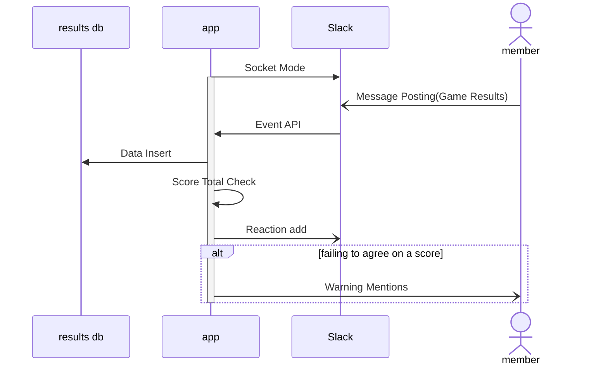
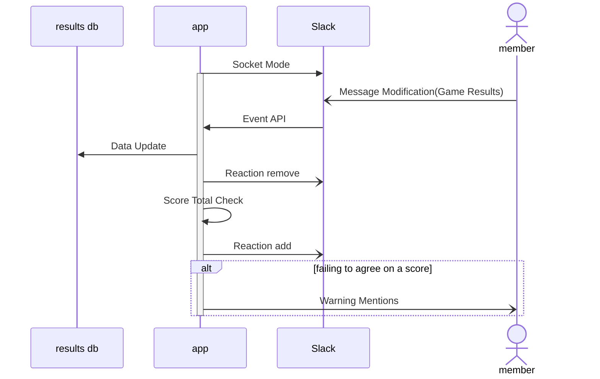

# データベース操作
## 成績登録

```mermaid
sequenceDiagram
    participant results db
    participant app
    participant Slack
    actor member

    app->>Slack: Socket Mode
    activate app
    member-)Slack: Message Posting(Game Results)
    Slack->>app: Event API
    app->>results db: Data Insert
    app->>app: Score Total Check
    app-)Slack: Reaction add
    alt failing to agree on a score
    app-)member: Warning Mentions
    end
    deactivate app
```

## 成績修正

```mermaid
sequenceDiagram
    participant results db
    participant app
    participant Slack
    actor member

    app->>Slack: Socket Mode
    activate app
    member-)Slack: Message Modification(Game Results)
    Slack->>app: Event API
    app->>results db: Data Update 
    app-)Slack: Reaction remove
    app->>app: Score Total Check
    app-)Slack: Reaction add
    alt failing to agree on a score
    app-)member: Warning Mentions
    end
    deactivate app
```

## 成績削除

```mermaid
sequenceDiagram
    participant results db
    participant app
    participant Slack
    actor member

    app->>Slack: Socket Mode
    activate app
    member-)Slack: Message Deletion(Game Results)
    Slack->>app: Event API
    app->>results db: Data Delet
    deactivate app
```
