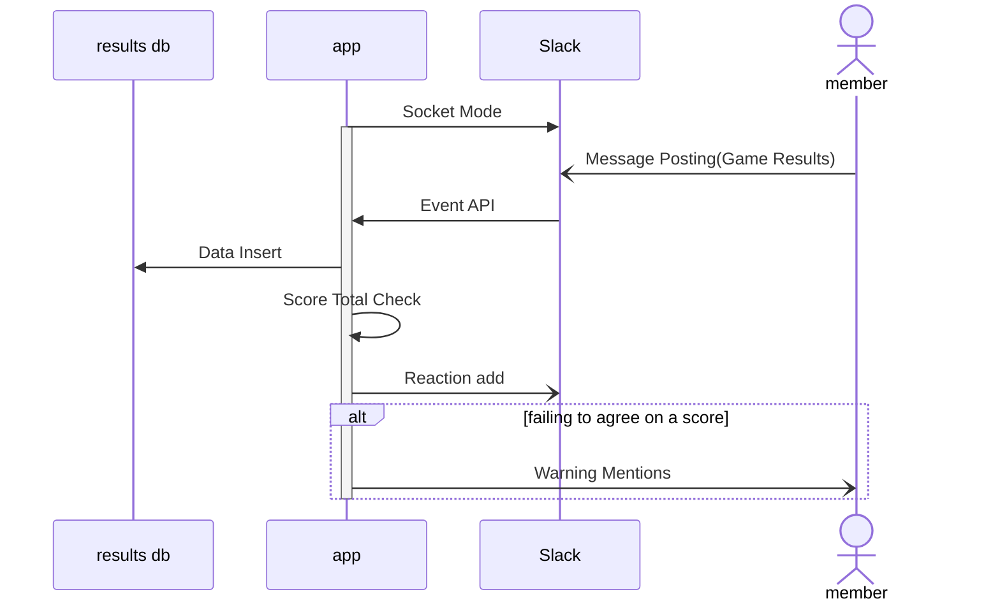
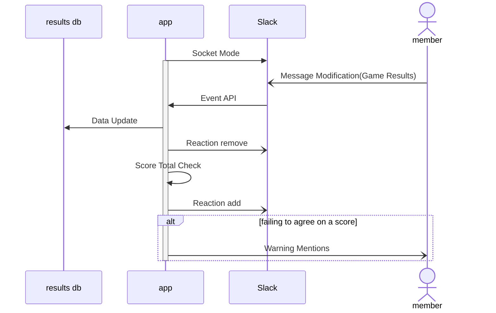
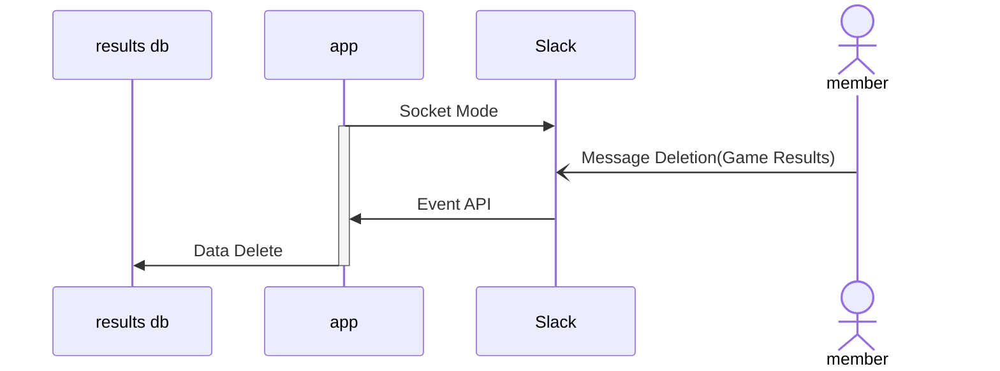
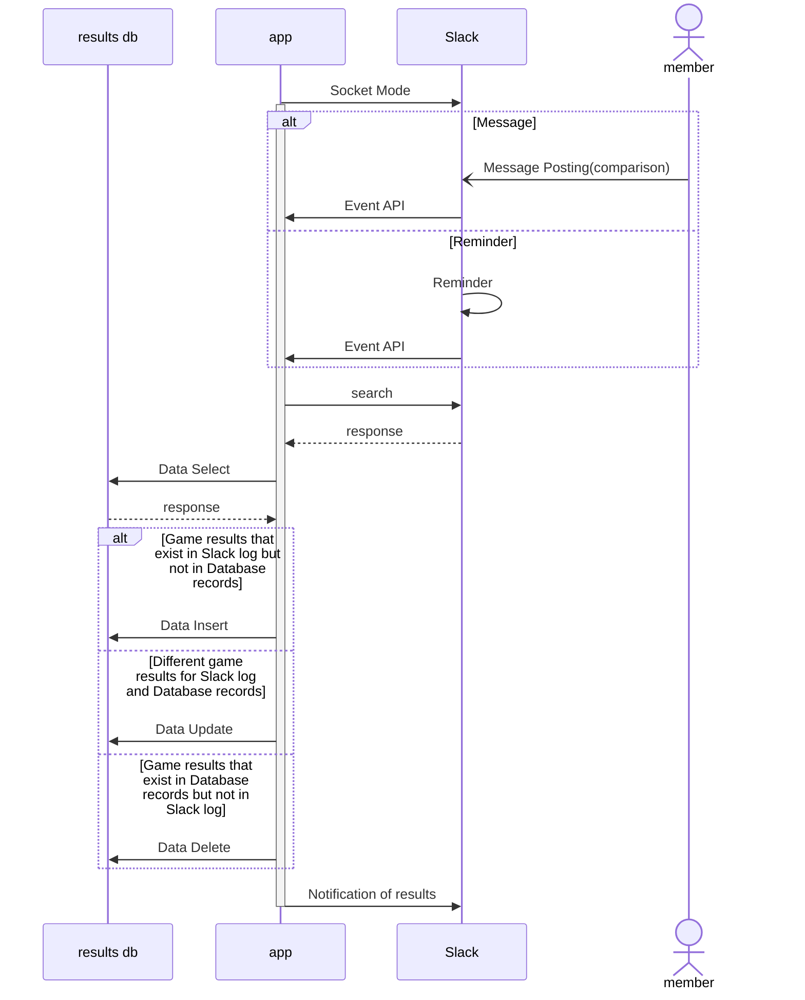

# データベース操作
## 成績登録

```mermaid
sequenceDiagram
    participant results db
    participant app
    participant Slack
    actor member

    app->>Slack: Socket Mode
    activate app
    member-)Slack: Message Posting(Game Results)
    Slack->>app: Event API
    app->>results db: Data Insert
    app->>app: Score Total Check
    app-)Slack: Reaction add
    alt failing to agree on a score
    app-)member: Warning Mentions
    end
    deactivate app
```

## 成績修正

```mermaid
sequenceDiagram
    participant results db
    participant app
    participant Slack
    actor member

    app->>Slack: Socket Mode
    activate app
    member-)Slack: Message Modification(Game Results)
    Slack->>app: Event API
    app->>results db: Data Update
    app-)Slack: Reaction remove
    app->>app: Score Total Check
    app-)Slack: Reaction add
    alt failing to agree on a score
    app-)member: Warning Mentions
    end
    deactivate app
```

## 成績削除

```mermaid
sequenceDiagram
    participant results db
    participant app
    participant Slack
    actor member

    app->>Slack: Socket Mode
    activate app
    member-)Slack: Message Deletion(Game Results)
    Slack->>app: Event API
    app->>results db: Data Delete
    deactivate app
```

## 突合

```mermaid
sequenceDiagram
    participant results db
    participant app
    participant Slack
    actor member

    app->>Slack: Socket Mode
    activate app

    alt Message
    member-)Slack: Message Posting(comparison)
    Slack->>app: Event API
    else Reminder
    Slack->>Slack: Reminder
    Slack->>app: Event API
    end

    app->>Slack: search
    Slack-->>app: response
    app->>results db: Data Select
    results db-->>app: response

    alt Game results that exist in Slack log but not in Database records
    app->>results db: Data Insert
    else Different game results for Slack log and Database records
    app->>results db: Data Update
    else Game results that exist in Database records but not in Slack log
    app->>results db: Data Delete
    end

    app->>Slack: Notification of results
    deactivate app
```
