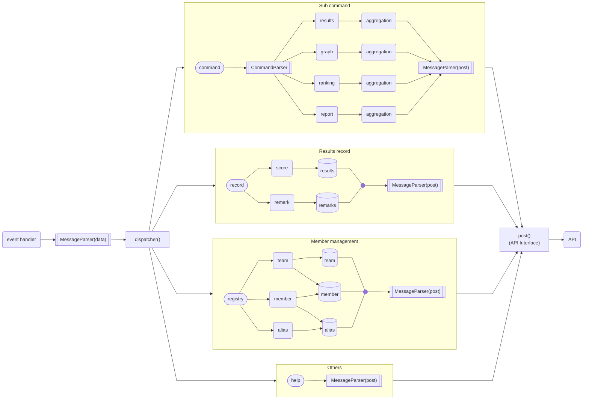

# インターフェース

```mermaid
---
config:
  flowchart:
    curve: linear
---
flowchart LR
    event(event handler);
    a(API);
    m1[["MessageParser(data)"]];

    event --> m1 --> d["dispatcher()"] --> f1 & f2 & f3 & f4;

    subgraph f1[Sub command]
        direction LR
        c([command]) --> cp[[CommandParser]];
        cp --> sc1(results) --> p1(aggregation);
        cp --> sc2(graph) --> p2(aggregation);
        cp --> sc3(ranking) --> p3(aggregation);
        cp --> sc4(report) --> p4(aggregation);
        p1 & p2 & p3 & p4 --> mp1[["MessageParser(post)"]];
    end

    subgraph f2[Results record]
        direction LR
        r2([record]);
        r2 --> a1(score) --> results[(results)] --- j2;
        r2 --> a2(remark) --> remarks[(remarks)] --- j2;
        j2@{shape: f-circ};
        j2 --> mp2[["MessageParser(post)"]];
    end

    subgraph f3[Member management]
        direction LR
        r1([registry]);
        r1 --> a4(team) --> db2[(team)] & db1;
        r1 --> a3(member) --> db1[(member)] & db3[(alias)];
        r1 --> a5(alias) --> db3;
        db1 & db2 & db3 --- j1@{shape: f-circ};
        j1 --> mp3[["MessageParser(post)"]];
    end

    subgraph f4[Others]
        direction LR
        h([help]) --> mp4[["MessageParser(post)"]];
    end

    f1 & f2 & f3 & f4 --> post["post()<br>(API Interface)"] --> a;
```
