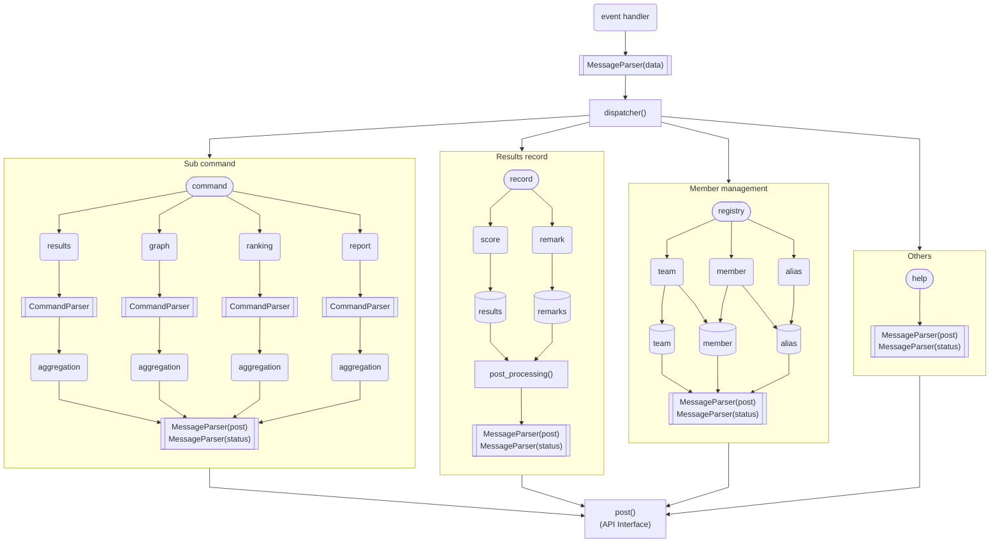
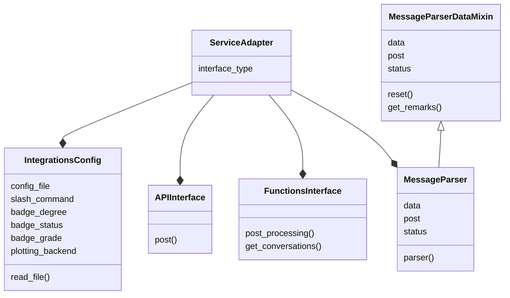

# インターフェース

# アダプタ
アプリ起動時に指定されたサービスのアダプタが設定される。\
アダプタは以下のクラスを含む抽象化されたクラスである。

- IntegrationsConfig
- APIInterface
- FunctionsInterface
- MessageParser

関係図

## IntegrationsConfig
指定サービスのみで利用する設定値を保存する。\
設定値は設定ファイルのサービス名と同じセクションに記述する。

## APIInterface
指定サービスに対して出力を行う。\
出力する内容は`MessageParser`の`post`データクラスが保持している。

## FunctionsInterface
指定サービスに対するサービス専用の関数群。\
`APIInterface`、`MessageParser`から利用される。

## MessageParser
MessageParserは指定サービスから入力されたテキストデータをコマンドと引数に分ける役割を担う。\
状態を保持するためのデータクラスを3つ持つ。
- data
- post
- status

### data
入力されたテキストデータの情報を保持する。
- 入力テキスト
- イベント発生タイムスタンプ
- その他

### post
各機能で集計した結果など、出力するデータを保持する。
- 集計結果
- 生成ファイル
- メッセージデータ
  - 集計期間などの補助情報
- その他

### status
各機能の最終的なステータス情報を保持する。
- DBに対する操作
- 更新したデータの状態
  - 矛盾したデータで更新した、など
- 処理結果
- その他

# ディスパッチャー
各機能はディスパッチテーブルから呼び出される。\
呼び出される機能は`MessageParser`を引数に取る。必要な情報は`data`データクラスから取得する。

呼び出された機能はそれぞれ必要な処理を実施し、結果を`post`データクラスと`status`データクラスに保存する。\
サービス単位で後処理があるものは`FunctionsInterface`の`post_processing()`で処理する。

# ロギング
デバッグ/メンテナンス用のログレベルの定義

| facility | log level |                            出力時の意味付け                            |           備考           |
| -------- | --------- | ---------------------------------------------------------------------- | ------------------------ |
| TRACE    | 5         | 処理の遷移などを表示                                                   | カスタムログレベル       |
| DEBUG    | 10        | 各処理に必要なパラメータの表示、処理結果の表示                         |                          |
| INFO     | 20        | 各処理の状態を表示                                                     | 通常ログ                 |
| WARNING  | 30        | 想定通りの処理結果にならなかったが、動作に影響ないエラー               |                          |
| ERROR    | 40        | 想定通りの処理結果になっておらず、テータに矛盾が生じた可能性がある状態 | データ修正が必要なエラー |
| CRITICAL | 50        | 動作を続けるとデータ破壊などが発生しうる状態                           | exit()させる             |
