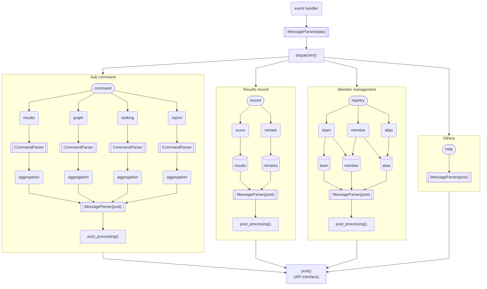

# インターフェース

```mermaid
---
config:
  flowchart:
    curve: linear
---
flowchart TB
    event(event handler);
    m1[["MessageParser(data)"]];

    event --> m1 --> d["dispatcher()"] --> f1 & f2 & f3 & f4;

    subgraph f1[Sub command]
        direction TB
        c([command]) --> sc1 & sc2 & sc3 & sc4;
        sc1(results) --> cp1[[CommandParser]] --> p1(aggregation);
        sc2(graph) --> cp2[[CommandParser]] --> p2(aggregation);
        sc3(ranking) --> cp3[[CommandParser]] --> p3(aggregation);
        sc4(report) --> cp4[[CommandParser]] --> p4(aggregation);
        p1 & p2 & p3 & p4 --> mp1[["MessageParser(post)"]] --> pp1["post_processing()"];
    end

    subgraph f2[Results record]
        direction TB
        r2([record]);
        r2 --> a1(score) --> results[(results)];
        r2 --> a2(remark) --> remarks[(remarks)];
        results & remarks --> mp2[["MessageParser(post)"]] --> pp2["post_processing()"];
    end

    subgraph f3[Member management]
        direction TB
        r1([registry]);
        r1 --> a4(team) --> db2[(team)] & db1;
        r1 --> a3(member) --> db1[(member)] & db3[(alias)];
        r1 --> a5(alias) --> db3;
        db1 & db2 & db3  --> mp3[["MessageParser(post)"]] --> pp3["post_processing()"];
    end

    subgraph f4[Others]
        direction TB
        h([help]) --> mp4[["MessageParser(post)"]];
    end

    f1 & f2 & f3 & f4 --> post["post()<br>(API Interface)"];
```
