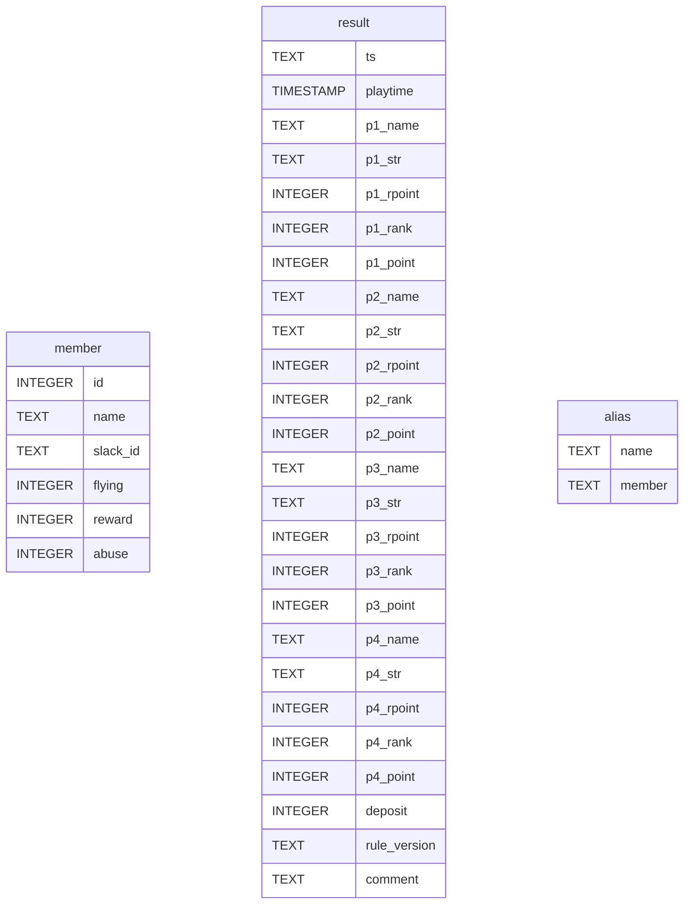

# テーブル

## result

| カラム名     | 制約 | 内容                                  |
| ------------ | ---- | ------------------------------------- |
| ts           |      | slackにポストされた時間               |
| playtime     |      | タイムスタンプ(tsを変換)              |
| p1_name      |      | 東家プレイヤー名                      |
| p1_str       |      | slackに入力された東家の素点           |
| p1_rpoint    |      | 東家素点(計算後)                      |
| p1_rank      |      | 東家順位                              |
| p1_point     |      | 東家が獲得したポイント                |
| p2_name      |      | 南家プレイヤー名                      |
| p2_str       |      | slackに入力された南家の素点           |
| p2_rpoint    |      | 南家素点(計算後)                      |
| p2_rank      |      | 南家順位                              |
| p2_point     |      | 南家が獲得したポイント                |
| p3_name      |      | 西家プレイヤー名                      |
| p3_str       |      | slackに入力された西家の素点           |
| p3_rpoint    |      | 西家素点(計算後)                      |
| p3_rank      |      | 西家順位                              |
| p3_point     |      | 西家が獲得したポイント                |
| p4_name      |      | 北家プレイヤー名                      |
| p4_str       |      | slackに入力された北家の素点           |
| p4_rpoint    |      | 北家素点(計算後)                      |
| p4_rank      |      | 北家順位                              |
| p4_point     |      | 北家が獲得したポイント                |
| deposit      |      | 供託                                  |
| rule_version |      | ルールバージョンを示す文字列          |
| comment      |      | コメント入力欄(入力できるI/Fは未実装) |

# ビュー

## game_results

| カラム名     | 制約 | 内容                         |
| ------------ | ---- | ---------------------------- |
| playtime     |      | タイムスタンプ               |
| p1_name      |      | 東家プレイヤー名             |
| p1_guest     |      | 東家ゲストフラグ(1=ゲスト)   |
| p1_rpoint    |      | 東家素点(計算後)             |
| p1_rank      |      | 東家順位                     |
| p1_point     |      | 東家が獲得したポイント       |
| p2_name      |      | 南家プレイヤー名             |
| p2_guest     |      | 南家ゲストフラグ(1=ゲスト)   |
| p2_rpoint    |      | 南家素点(計算後)             |
| p2_rank      |      | 南家順位                     |
| p2_point     |      | 南家が獲得したポイント       |
| p3_name      |      | 西家プレイヤー名             |
| p3_guest     |      | 西家ゲストフラグ(1=ゲスト)   |
| p3_rpoint    |      | 西家素点(計算後)             |
| p3_rank      |      | 西家順位                     |
| p3_point     |      | 西家が獲得したポイント       |
| p4_name      |      | 北家プレイヤー名             |
| p4_guest     |      | 北家ゲストフラグ(1=ゲスト)   |
| p4_rpoint    |      | 北家素点(計算後)             |
| p4_rank      |      | 北家順位                     |
| p4_point     |      | 北家が獲得したポイント       |
| deposit      |      | 供託                         |
| collection   |      | 集計対象年月(YYYY-MM)        |
| rule_version |      | ルールバージョンを示す文字列 |

## individual_results

| カラム名     | 制約 | 内容                         |
| ------------ | ---- | ---------------------------- |
| playtime     |      | タイムスタンプ               |
| seat         |      | 席(0=東、1=南、2=西、3=北)   |
| name         |      | プレイヤー名                 |
| rpoint       |      | 素点(計算後)                 |
| rank         |      | 順位                         |
| point        |      | 獲得ポイント                 |
| guest        |      | ゲストフラグ(1=ゲスト)       |
| collection   |      | 集計対象年月(YYYY-MM)        |
| rule_version |      | ルールバージョンを示す文字列 |
