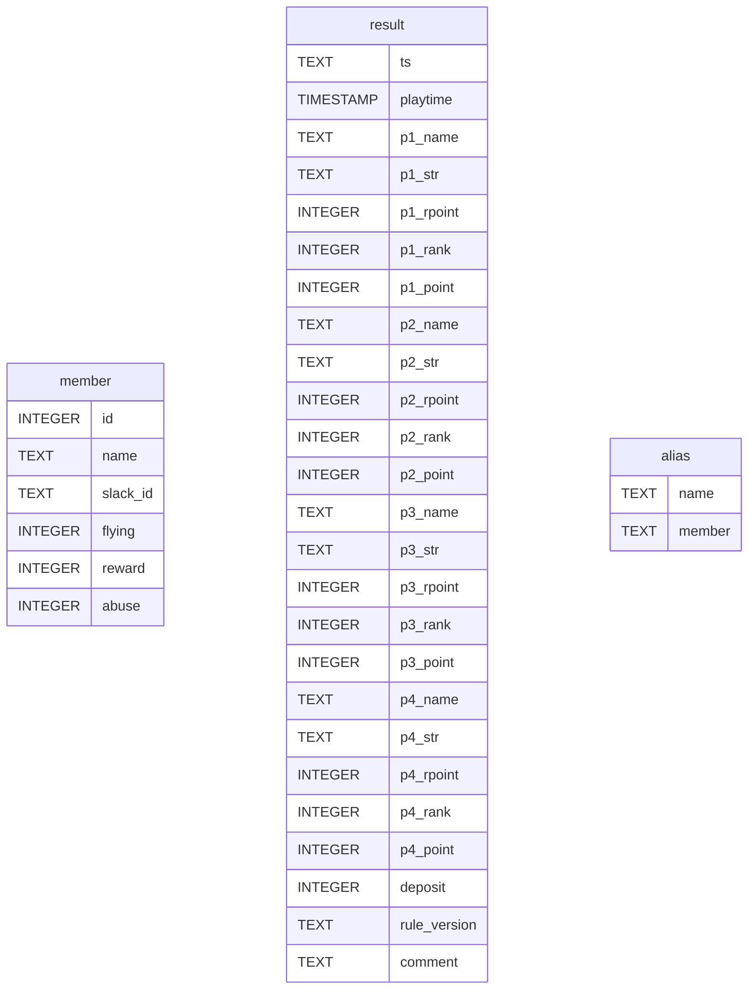

# テーブル

```mermaid
erDiagram
	member {
		INTEGER id
		TEXT name
		TEXT slack_id
		INTEGER flying
		INTEGER reward
		INTEGER abuse
	}

    result {
        TEXT ts
        TIMESTAMP playtime
        TEXT p1_name
        TEXT p1_str
        INTEGER p1_rpoint
        INTEGER p1_rank
        INTEGER p1_point
        TEXT p2_name
        TEXT p2_str
        INTEGER p2_rpoint
        INTEGER p2_rank
        INTEGER p2_point
        TEXT p3_name
        TEXT p3_str
        INTEGER p3_rpoint
        INTEGER p3_rank
        INTEGER p3_point
        TEXT p4_name
        TEXT p4_str
        INTEGER p4_rpoint
        INTEGER p4_rank
        INTEGER p4_point
        INTEGER deposit
        TEXT rule_version
        TEXT comment
    }

	alias {
		TEXT name
		TEXT member
	}
```
